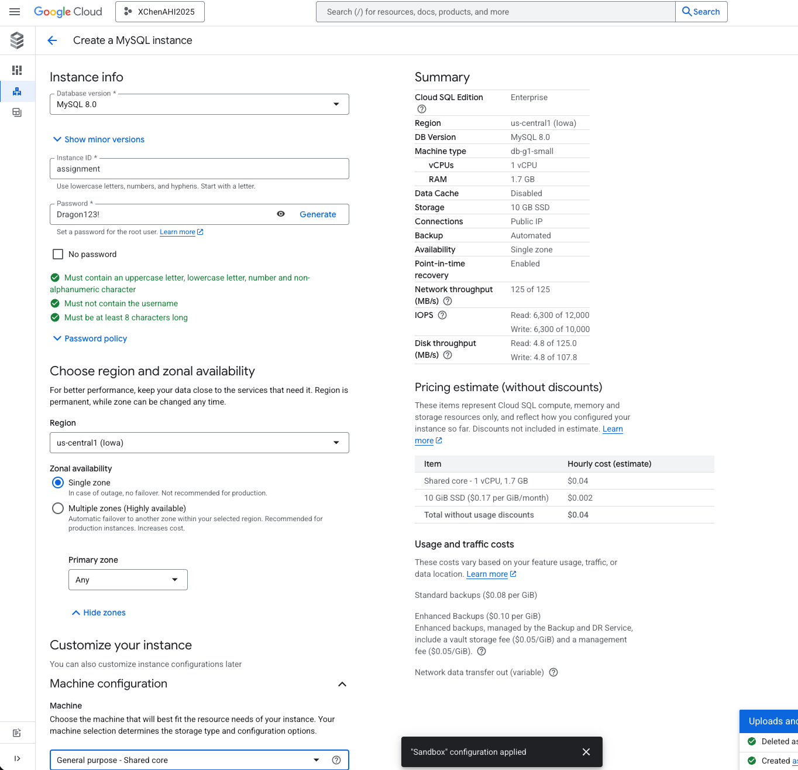
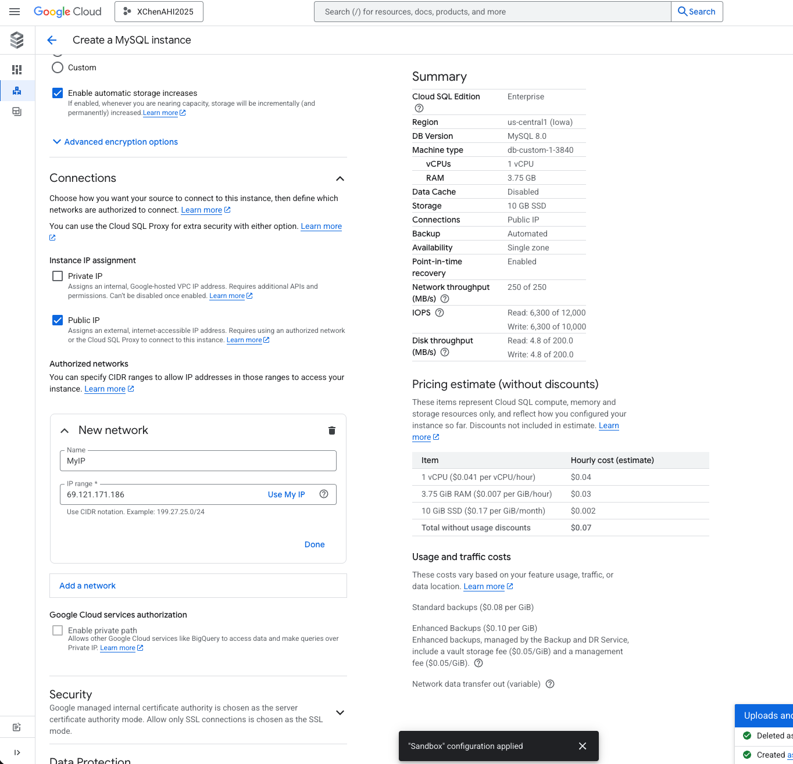
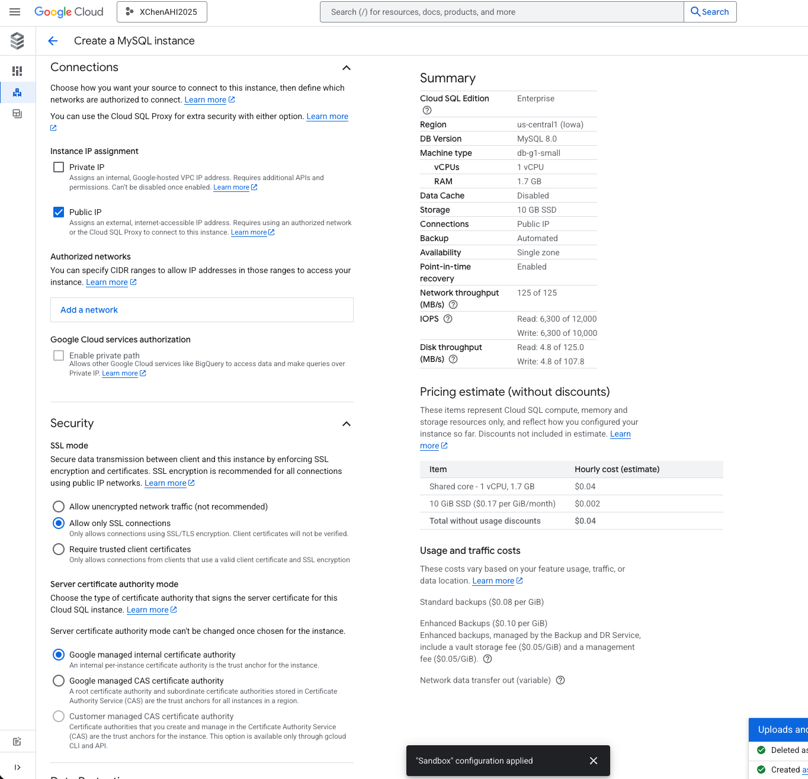
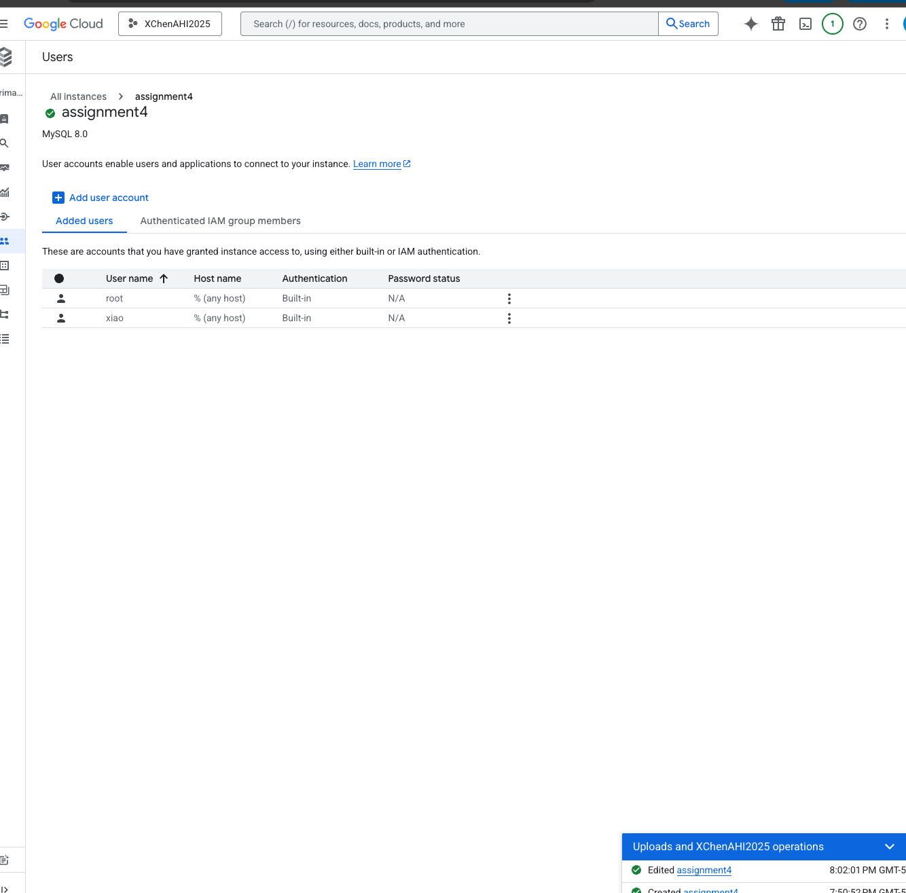
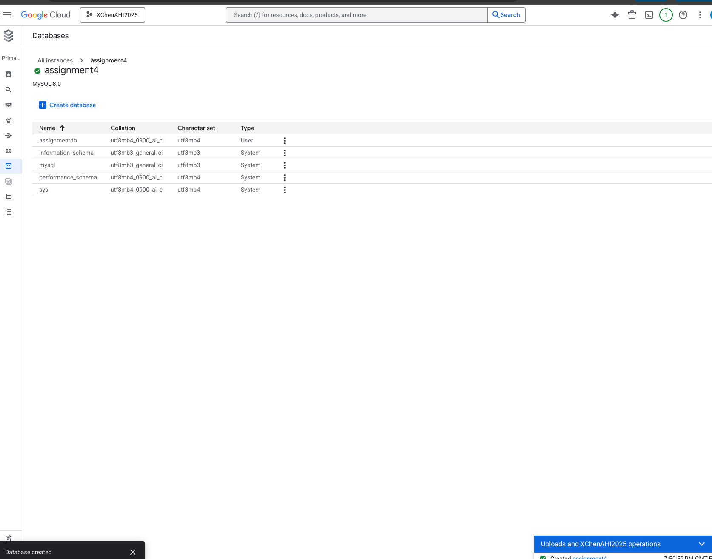
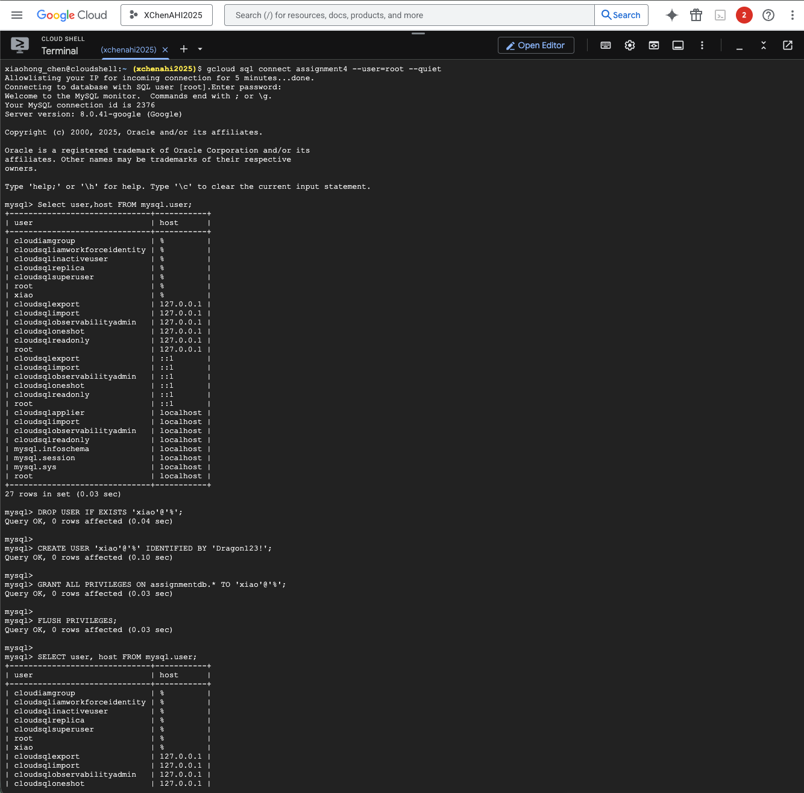
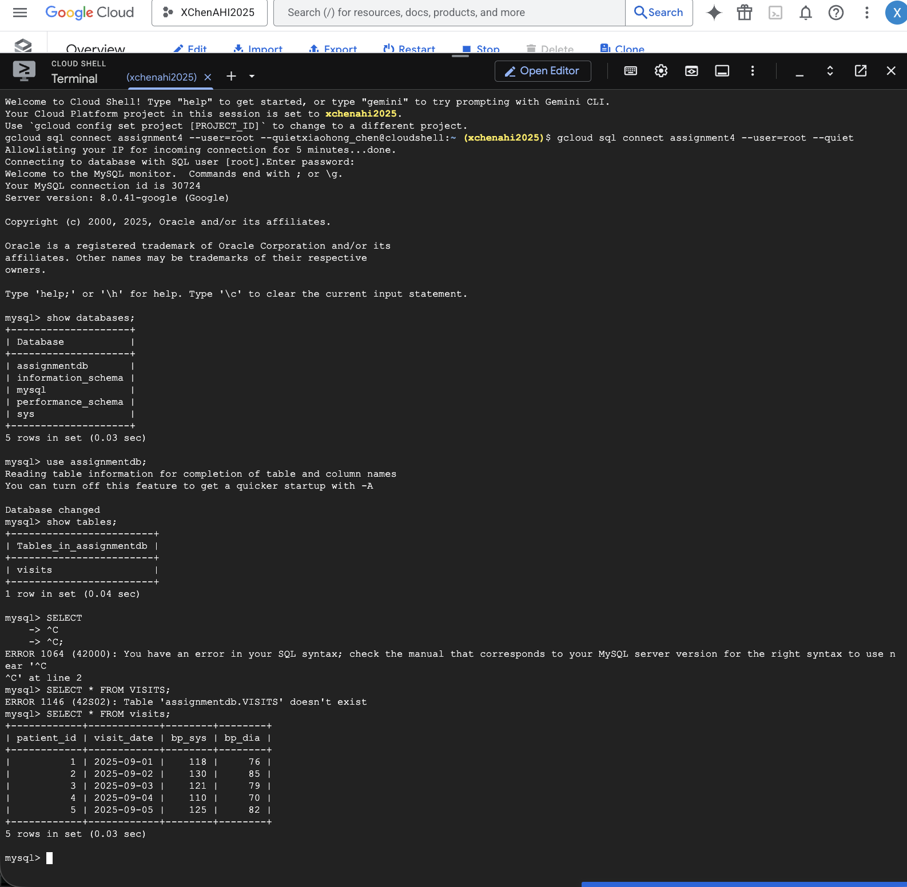

# Managed Set up Notes

1) Create instance in Cloud SQL
    * Choose MySQL for database engine
    * Select Enterprise/ Sandbox Edition
    * Choose MySQL 8.0
    * Name instance "assignment4"
    * set password as Dragon123!
    * US - central1 / single zone
    * General purpose - Dedicated core with 1vCPU
    * Check in Public IP
    * Add New Network, Select "Use my IP" and name it Local Machine
    * Check in Allow unencrypted network traffic
    * Create Instance
    
    
    

2) Create user in Instance
    * Go into your newly created Instance and click on user, add user account
    * Username : xiao
    * Password: Dragon123!
    * Allow any host
    * Add


3) Create database in Instance
    * Click on database on left sidebar
    * Click create database
    * Database Name: assignmentdb
    * Click create



4) Open Cloud Shell 
    * Open cloud shell in your instance overview
    * Click on Terminal 
    * Click Enter on the first line of code
    ```
    gcloud sql connect assignment4 --user=root --quiet
    ```
    * Enter password: Dragon123!

5) Create user on Shell and grant PRIVILEGES (I had to delete user created to recreate the same user with all privileges)
    * DROP USER IF EXISTS 'xiao'@'%';
    * CREATE USER 'xiao'@'%' IDENTIFIED BY 'Dragon123!';
    * GRANT ALL PRIVILEGES ON assignment.* TO 'xiao'@'%';
    * FLUSH PRIVILEGES;
    * SELECT user,host FROM mysql.user;
    * SHOW GRANTS FOR 'xiao'@'%';
    


6) Fill out .env file with the appropriate answers
    * MAN_DB_HOST, MAN_DB_USER, MAN_DB_PASS, MAN_DB_NAME

```
# Managed MySQL
MAN_DB_HOST=104.197.139.224
MAN_DB_PORT=3306
MAN_DB_USER=xiao
MAN_DB_PASS=Dragon123!
MAN_DB_NAME=assignmentdb
```

7) Run managed_demo.py on VSCode to insert database
    * Create venv. and run pip install sqlalchemy pymysql pandas python-dotenv
    * Next, run managed_demo.py
    ```
    import os, time
    from datetime import datetime
    import pandas as pd
    from sqlalchemy import create_engine, text
    from dotenv import load_dotenv

    # --- 0) Load environment ---
    load_dotenv(".env", override=True)  # reads .env in current working directory

    MAN_DB_HOST = os.getenv("MAN_DB_HOST")
    MAN_DB_PORT = os.getenv("MAN_DB_PORT", "3306")
    MAN_DB_USER = os.getenv("MAN_DB_USER")
    MAN_DB_PASS = os.getenv("MAN_DB_PASS")
    MAN_DB_NAME = os.getenv("MAN_DB_NAME")

    print("[ENV] MAN_DB_HOST:", MAN_DB_HOST)
    print("[ENV] MAN_DB_PORT:", MAN_DB_PORT)
    print("[ENV] MAN_DB_USER:", MAN_DB_USER)
    print("[ENV] MAN_DB_NAME:", MAN_DB_NAME)

    # --- 1) Connect to server (no DB) and ensure database exists ---
    server_url = f"mysql+pymysql://{MAN_DB_USER}:{MAN_DB_PASS}@{MAN_DB_HOST}:{MAN_DB_PORT}"
    print("[STEP 1] Connecting to MySQL server (no DB):", server_url.replace(MAN_DB_PASS, "*****"))
    t0 = time.time()

    # For managed MySQL, SSL is often required - adjust connect_args accordingly
    engine_server = create_engine(
        server_url, 
        connect_args={"ssl": None},
        pool_pre_ping=True
    )
    with engine_server.connect() as conn:
        conn.execute(text(f"CREATE DATABASE IF NOT EXISTS `{MAN_DB_NAME}`"))
        conn.commit()
    print(f"[OK] Ensured database `{MAN_DB_NAME}` exists.")

    # --- 2) Connect to the target database ---
    db_url = f"mysql+pymysql://{MAN_DB_USER}:{MAN_DB_PASS}@{MAN_DB_HOST}:{MAN_DB_PORT}/{MAN_DB_NAME}"
    engine = create_engine(
        db_url,
        connect_args={"ssl": None}
    )

    # --- 3) Create a DataFrame and write to a table ---
    table_name = "visits"
    df = pd.DataFrame(
        [
            {"patient_id": 1, "visit_date": "2025-09-01", "bp_sys": 118, "bp_dia": 76},
            {"patient_id": 2, "visit_date": "2025-09-02", "bp_sys": 130, "bp_dia": 85},
            {"patient_id": 3, "visit_date": "2025-09-03", "bp_sys": 121, "bp_dia": 79},
            {"patient_id": 4, "visit_date": "2025-09-04", "bp_sys": 110, "bp_dia": 70},
            {"patient_id": 5, "visit_date": "2025-09-05", "bp_sys": 125, "bp_dia": 82},
        ]
    )

    # Remove connect_args from to_sql() - it's already in the engine
    df.to_sql(table_name, con=engine, if_exists="replace", index=False)

    # --- 4) Read back a quick check ---
    print("[STEP 4] Reading back row count ...")
    with engine.connect() as conn:
        count_df = pd.read_sql(f"SELECT COUNT(*) AS n_rows FROM `{table_name}`", con=conn)
    print(count_df)

    elapsed = time.time() - t0
    print(f"[DONE] Managed path completed in {elapsed:.1f}s at {datetime.utcnow().isoformat()}Z")
    ```
    * I encountered the most trouble durring this part. MySQL was not conencting to query. I had to go into MySQL instance and Allow unencrypted network traffic. When I was doing it at home, it worked perfectly afterwards. As I am typing this at work and connected to the hospital wifi, I am not allowed to connect again. I tried my phone's hotspot as well and it still feeds back an error, unable to connect. I tried put my new IP address as an authorized network in MYSQL instance but I still get the same error. I will try again when I get home. 

######### insert photo when I get home

8) Open Cloud Shell to view table
    ```
    gcloud sql connect assignment4 --user=root --quiet
    ```
    * insert password: Dragon123!
    * show databases;
    * use assignmentdb;
    * show tables;
    * SELECT * FROM visits;
    
