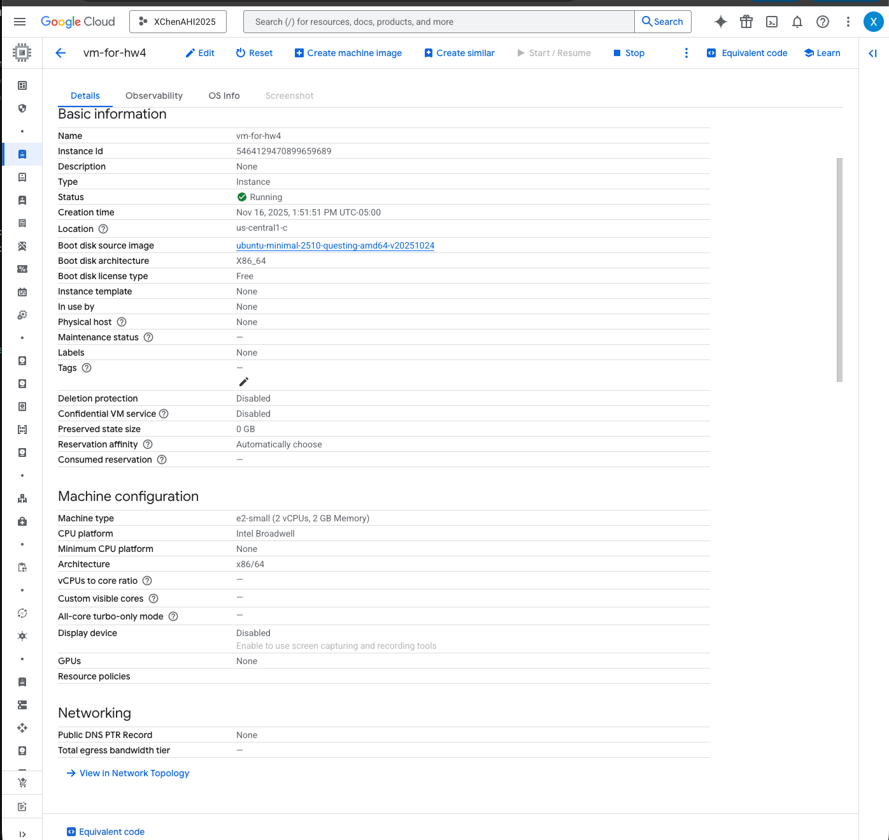
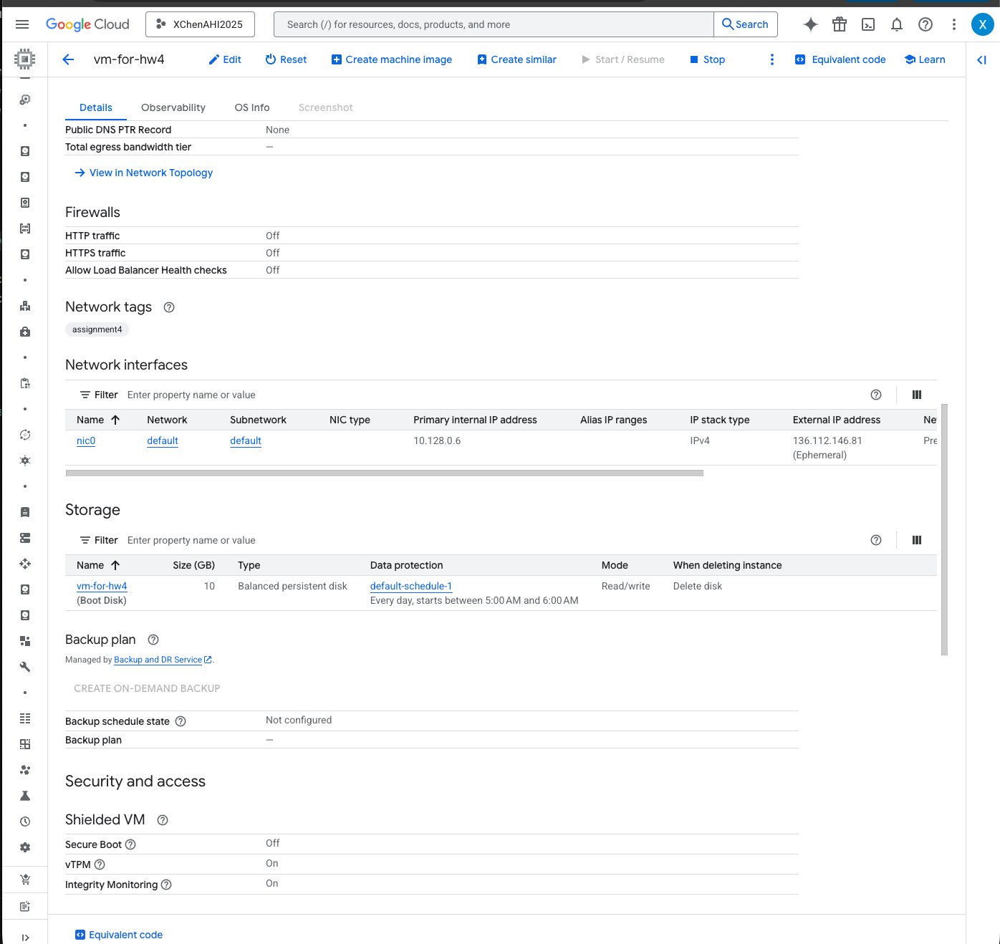
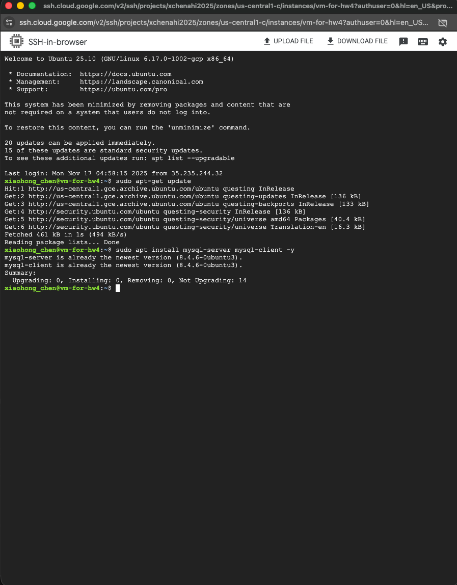
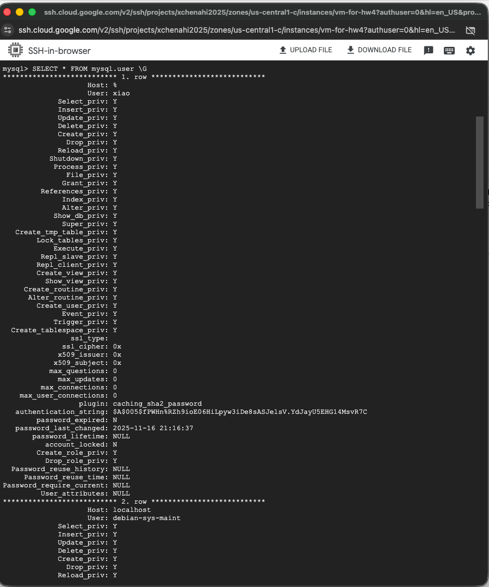
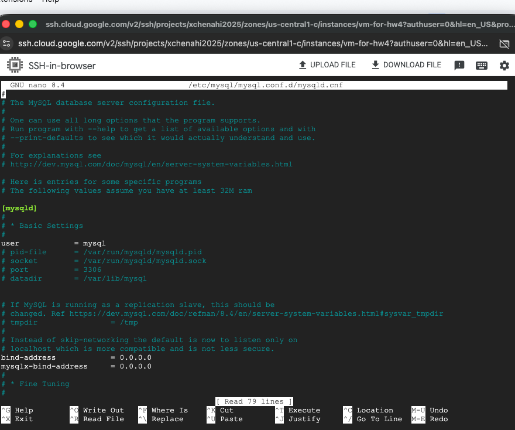

# VM setup notes

1) Create a Firewall Rule:
    * IPv4 source should be: 0.0.0.0/0
    * Check in TCP and enter 22, 3306
    * create firewall rule named: assignment4


2) Create VM instance on GCP:
    * Leave region as default
    * Select E2-small for low cost
    * Change OS to Ubuntu
    * Under Network Tags, tag assignment4 for port
    * create VM instance named:vm-for-hw4



3) SSH
    * update SSH
    ``` 
    sudo apt-get update
    sudo apt install mysql-server mysql-client -y
    ``` 
    


    * Create user and grant privileges
    ```
    sudo mysql
    CREATE USER 'xiao'@'%' IDENTIFIED BY 'dragon123!';
    GRANT ALL PRIVILEGES ON *.* TO 'xiao'@'%' WITH GRANT OPTION

    # can check privileges using:
    SELECT * FROM mysql.user \G
    ```
    

    * Create table 
    ```
    show databases;
    create database vm-for-hw4;

    # check creation of table:
    show databases;
    use vm-for-hw4;
    show tables;
    ```
    
4) Exit out of SQL and edit NANO to allow connection to database
    * Exit out of SQL
    ```
    exit;
    ```


    * install NANO and change bind-address and mysqlx-bind-address to 0.0.0.0 to allow all ingress
    ```
    sudo apt install nano
    sudo nano /etc/mysql/mysql.conf.d/mysqld.cnf
    ```
        - press CTRL + O to save
        - press ENTER to confirm
        - press CTRL + X to exit out
        - restart SSH to confirm changes

    

5) Now you are able to connect through SSH through VSCode
    * Create your .env file and fill out VM_DB_HOST, VM_DB_USER, VM_DB_PASS, VM_DB_NAME based on your instance

6) Run vm_demo.py to create dataframe in your VM instance
    * Create venv. and run pip install sqlalchemy pymysql pandas python-dotenv
    * Next, run managed_demo.py
```
import os, time
from datetime import datetime
import pandas as pd
from sqlalchemy import create_engine, text
from dotenv import load_dotenv

# --- 0) Load environment ---
load_dotenv(".env")  # reads .env in current working directory

VM_DB_HOST = os.getenv("VM_DB_HOST")
VM_DB_PORT = os.getenv("VM_DB_PORT", "3306")
VM_DB_USER = os.getenv("VM_DB_USER")
VM_DB_PASS = os.getenv("VM_DB_PASS")
VM_DB_NAME = os.getenv("VM_DB_NAME")

print("[ENV] VM_DB_HOST:", VM_DB_HOST)
print("[ENV] VM_DB_PORT:", VM_DB_PORT)
print("[ENV] VM_DB_USER:", VM_DB_USER)
print("[ENV] VM_DB_NAME:", VM_DB_NAME)

# --- 1) Connect to server (no DB) and ensure database exists ---
server_url = f"mysql+pymysql://{VM_DB_USER}:{VM_DB_PASS}@{VM_DB_HOST}:{VM_DB_PORT}"
print("[STEP 1] Connecting to MySQL server (no DB):", server_url.replace(VM_DB_PASS, "*****"))
t0 = time.time()

engine_server = create_engine(server_url, pool_pre_ping=True, connect_args={"ssl": None})
with engine_server.connect() as conn:
    conn.execute(text(f"CREATE DATABASE IF NOT EXISTS `{VM_DB_NAME}`"))
    conn.commit()
print(f"[OK] Ensured database `{VM_DB_NAME}` exists.")

# --- 2) Connect to the target database ---
#### ignore ssl_connection for VM setup
db_url = f"mysql+pymysql://{VM_DB_USER}:{VM_DB_PASS}@{VM_DB_HOST}:{VM_DB_PORT}/{VM_DB_NAME}"
engine = create_engine(db_url, connect_args={"ssl": None})

# --- 3) Create a DataFrame and write to a table ---
table_name = "visits"
df = pd.DataFrame(
    [
        {"patient_id": 1, "visit_date": "2025-09-01", "bp_sys": 118, "bp_dia": 76},
        {"patient_id": 2, "visit_date": "2025-09-02", "bp_sys": 130, "bp_dia": 85},
        {"patient_id": 3, "visit_date": "2025-09-03", "bp_sys": 121, "bp_dia": 79},
        {"patient_id": 4, "visit_date": "2025-09-04", "bp_sys": 110, "bp_dia": 70},
        {"patient_id": 5, "visit_date": "2025-09-05", "bp_sys": 125, "bp_dia": 82},
    ]
)

df.to_sql(table_name, con=engine, if_exists="replace", index=False)

# --- 4) Read back a quick check ---
print("[STEP 4] Reading back row count ...")
with engine.connect() as conn:
    count_df = pd.read_sql(f"SELECT COUNT(*) AS n_rows FROM `{table_name}`", con=conn)
print(count_df)

elapsed = time.time() - t0
print(f"[DONE] VM path completed in {elapsed:.1f}s at {datetime.utcnow().isoformat()}Z")
```


7) Check SSH for database and confirmation
    * go into SSH
    ```
    sudo mysql
    show databases;
    use vm-for-hw4;
    show tables;
    select * from visits;
    ```
 
 