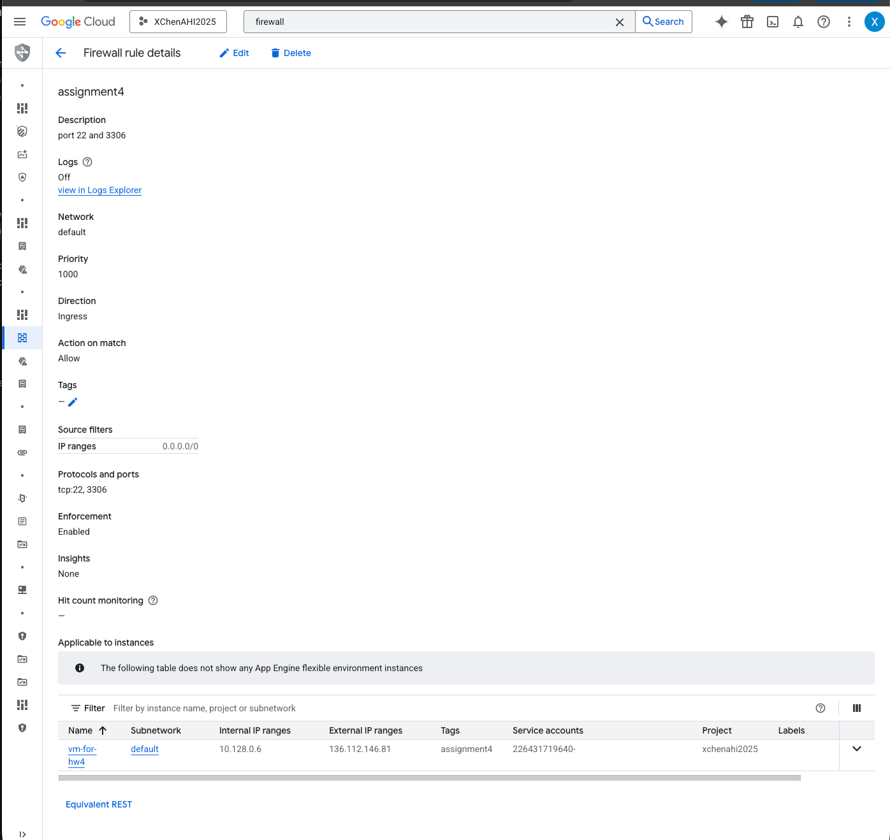

# VM setup notes

1) Create a Firewall Rule:
    * IPv4 source should be: 0.0.0.0/0
    * Check in TCP and enter 22, 3306
    * create firewall rule named: assignment4

2) Create VM instance on GCP:
    * Leave region as default
    * Select E2-small for low cost
    * Change OS to Ubuntu
    * Under Network Tags, tag assignment4 for port
    * create VM instance named:vm-for-hw4

3) 